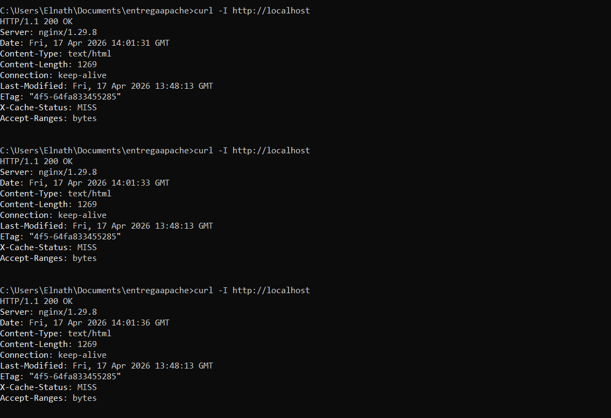
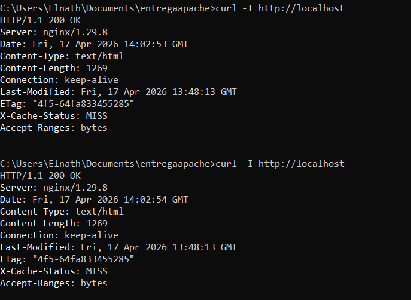

# Memòria de la Pràctica: Proxies Inversos amb Nginx

  

**Assignatura:** 0378 SAD - Administració de Sistemes Operatius en Xarxa  
**Centre:** Institut El Calamot  
**Alumne:** Elnath Lavarino  
**Data:** 17 d'abril de 2026

---

## 1. Introducció
En aquesta pràctica he desenvolupat una infraestructura de xarxa utilitzant **Docker Compose** per implementar un proxy invers amb Nginx. L'objectiu és gestionar el trànsit cap a dos servidors Apache, aplicant balanç de càrrega i optimitizant el rendiment mitjançant una memòria cau (cache).

## 2. Objectius de la Pràctica
- Desplegar contenidors d'Apache i Nginx de forma coordinada.
- Implementar un volum compartit per mantenir la integritat del contingut web.
- Configurar el balanç de càrrega tipus Round Robin.
- Habilitar i verificar el sistema de proxy cache de Nginx.

## 3. Desenvolupament de la Infraestructura

### 3.1. Configuració del Web Server (Apache)
He utilitzat dos nodes anomenats `web1` i `web2`. Ambdós munten la carpeta local `./html` en el path `/usr/local/apache2/htdocs/`. D'aquesta manera, qualsevol canvi en el fitxer `index.html` es reflecteix immediatament en els dos servidors. El contingut inclou text personalitzat, estils CSS, una imatge SVG creada per a l'ocasió i un vídeo MP4.

### 3.2. Configuració del Proxy (Nginx)
El fitxer `nginx.conf` és el cor del sistema. He definit un `upstream` que apunta als dos nodes d'Apache. A més, he configurat:
- **Proxy Cache:** He definit una zona de memòria de 10MB i un directori de cache (`/var/cache/nginx`) vinculat a la meva carpeta local `./nginx/cache`.
- **Custom Headers:** He afegit les capçaleres `X-Backend-IP` (per saber quin node respon) si no ha estat servit des de la cache, i `X-Cache-Status` (per veure l'estat de la cache: HIT/MISS).

## 4. Evidències i Verificació

A continuació es mostren les captures de pantalla que demostren el correcte funcionament del sistema segons els requisits:

### 4.1. Visualització de la Pàgina Web
En aquesta captura es pot veure la pàgina web carregada correctament, amb el meu nom, el logo SVG i el reproductor de vídeo preparat.

### 4.2. Verificació del Balanç de Càrrega
Utilitzant la comanda `curl -I`, he comprovat que la capçalera `X-Backend-IP` canvia entre les adreces internes dels nodes Apache (ex: 172.18.0.2 i 172.18.0.3), demostrant que Nginx distribueix les peticions.

### 4.3. Funcionament de la Memòria Cau
Aquí es demostra com, després d'una primera petició (`MISS`), les següents són servides directament per Nginx des de la cache (`HIT`), millorant dràsticament el temps de resposta.

## 5. Conclusions i Problemes Trobats
Durant el desenvolupament, el repte principal ha estat la correcta configuració dels permisos del directori de cache i la sintaxi de les capçaleres personalitzades. Un cop resolt, el sistema s'ha mostrat molt estable. 

L'ús de **Docker Compose** ha facilitat enormement la replicació de l'entorn de producció en el meu equip local. Aquesta arquitectura és ideal per a entorns reals on es busca alta disponibilitat i velocitat.

---
*Signat: Elnath Lavarino*
